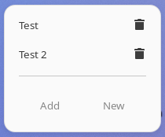

Welcome to the Google Meet Extension!

With this extension, you can quickly access your Google Meet bookmarks directly from the Gnome Shell panel. 

You can add new bookmarks, manage existing ones, and directly open Meet sessions in your browser.

Features:

- 'New Meet': Opens a new Google Meet session in your default browser.
-  'Add': Allows you to add a new bookmark to your Google Meet sessions. Simply provide a name and a unique code.

To delete a bookmark, simply click on the trash icon next to each bookmark in the menu.

For additional support, please contact the extension developer.

